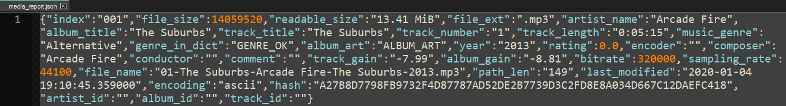
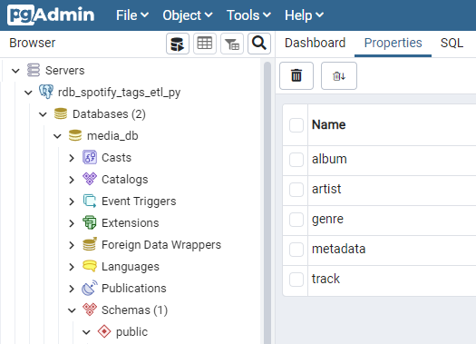

# *Music Library* ETL - Relational

[](https://opensource.org/licenses/MIT)
[](https://github.com/psf/black)
[](https://pycqa.github.io/isort/)
[](https://github.com/pre-commit/pre-commit)


## Python ETL for media tags:
* __Extract:__ data from local [JSON](./data/input/media_report.json)
* __Transform:__ convert JSON to SQL
* __Load:__ tag data to relational database (Postgres running in Docker)


## Data source


## Data sink



### Step 1: Setup API credentials
[Spotify OAuth2](https://developer.spotify.com/documentation/general/guides/authorization/)
```
# once generated, add to './config/spotify_cfg_private.toml':
[spotify.dev]
    client_id = "123456789abcdefg"        # <-- enter your CLIENT_ID
    client_secret = "abcdefg123456789"    # <-- enter your CLIENT_SECRET
    redirect_uri = "http://localhost/"
```

### Step 2: Setup Python Virtual Environment
[Poetry Commands](https://python-poetry.org/docs/cli/)
```
# check poetry
poetry --version

# use latest python version for venv
pyenv install --list | grep " 3.11"
pyenv install 3.11.0
pyenv local 3.11.0

# optional: update poetry settings
poetry config virtualenvs.in-project true
poetry config virtualenvs.prefer-active-python true
poetry config --list

# check pyproject.toml
poetry check
poetry lock

# upgrade pip within venv
poetry run python -m pip install --upgrade pip

# create virtual environment
poetry install -vvv | tee ./logs/poetry_install.log

# optional: update git settings
git config --global --add safe.directory "$(pwd)"
git config --list

# optional: setup pre-commit
poetry run pre-commit autoupdate
poetry run pre-commit install --install-hooks
```

### Step 3: Setup Docker container
[Install Docker Desktop](https://www.docker.com/products/docker-desktop)
[Docker Compose Commands](https://docs.docker.com/engine/reference/commandline/compose/)
```
# start PostgreSqL/pgAdmin in Docker as background daemon
docker-compose up --build -d

# optional: check container stats
docker ps
docker-compose ps

# optional: command line
docker exec -it {CONTAINER_ID} /bin/bash
```

### Step 4: Run ETL script
```
# with Docker backend running
poetry run python ./src/etl_demo.py

check data in pgadmin:
http://localhost:8085/login
```

## Cleanup and maintenance
```
# shut down container
docker-compose down --remove-orphans

# optional: update poetry
poetry self lock
poetry self install --sync |
poetry self update

# update dependencies in venv listed in 'pyproject.toml'
poetry update -vvv | tee ./logs/poetry_update.log
```

[Optional: Postgres shell Commands](https://www.postgresql.org/docs/13/app-psql.html)
```
# replace default port
sudo sed -i 's/port = 5432/port = 5413/g' /etc/postgresql/13/main/postgresql.conf
sudo service postgresql restart
sudo lsof -iTCP -sTCP:LISTEN | grep postgres
systemctl status postgres
psql -c "CREATE DATABASE media_db;" -U postgres
psql -c "CREATE USER run_admin_run WITH PASSWORD 'run_pass_run';" -U postgres
```


## Resources
* [RapidFuzz](https://github.com/maxbachmann/rapidfuzz)
* [Spotipy](https://spotipy.readthedocs.io)
* [pgadmin4](https://www.pgadmin.org/docs/pgadmin4/latest/container_deployment.html)
