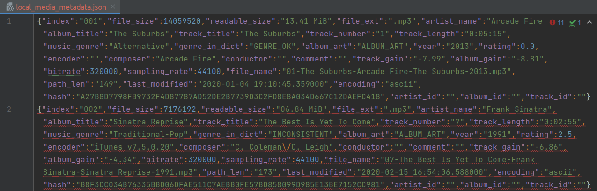
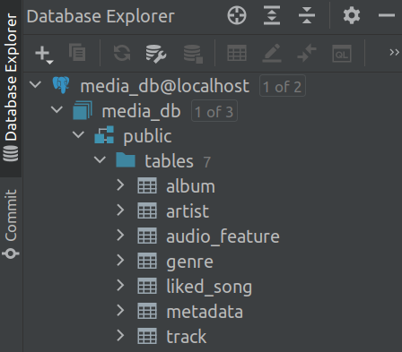
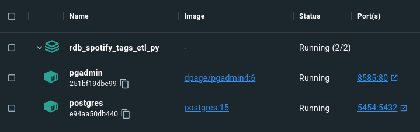
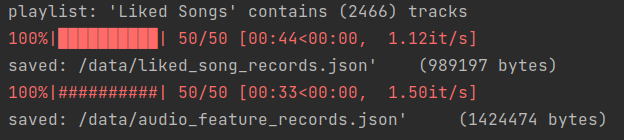

# *Music Library* ETL - Relational

[](https://opensource.org/licenses/MIT)
[](https://github.com/psf/black)
[](https://pycqa.github.io/isort/)
[](https://github.com/pre-commit/pre-commit)


## Project Rationale
Most of us have **local** music files (mp3, m4a, flac, wma, etc.) accumulated over the years.

Another 'media-parser' project was written to extract tags and metadata from local files and save results as standardized dataframes exported to JSON [here](./data/local_media_extract.json).

The purpose of **_this_** project is to use several data management tools to leverage APIs into usable *persistent* formats:
1) **Query tag data** from each track against **[Spotify Web API](https://developer.spotify.com/documentation/web-api/reference/get-users-saved-tracks)** to determine which [artist, album, track] ID belongs to each song.
   * given library managers (MediaMonkey, Rhythmbox, MusicBrainz, Mp3tag, iTunes, foobar2000, etc.) have different interpretations of tag data
   * process involves **[fuzzy pattern matching](https://github.com/maxbachmann/rapidfuzz)**

2) **Load *newline delimited* JSON** (source data generated by 'media-parser') to Postgres backend running in Docker orchestrated by this [ETL pipeline](./src/media_etl/run_pipeline.py).

3) **Query Spotify 'Liked Songs' playlist** from this [code](./src/media_etl/run_playlist_etl.py)
   * save API responses as custom formatted SQLModels
   * export [SQLModels](./src/media_etl/sql/models.py) as newline delimited JSON files (custom formatted rows)
   * load results to two new 'liked_song' and 'audio_feature' tables in Postgres

## Data source (offline)


## Data sink



### Step 1: Setup credentials
[Spotify OAuth2](https://developer.spotify.com/documentation/general/guides/authorization/)
```
# update *_secret.toml file to include your Spotify API credentials
cp './config/settings_example.toml' './config/settings_secret.toml'

within './config/*_secret.toml':
[spotify.dev]
    client_id = "123456789abcdefg"        # <-- enter your CLIENT_ID
    client_secret = "abcdefg123456789"    # <-- enter your CLIENT_SECRET

# update: './docker/config/*_secret.env':
cp './docker/config/postgres_example_dev.env' './docker/config/postgres_private_dev.env'

POSTGRES_PASSWORD  # <-- enter your credentials
POSTGRES_PASSWORD
PGADMIN_DEFAULT_EMAIL
PGADMIN_DEFAULT_PASSWORD
```

### Step 2: Setup Python Virtual Environment
[Poetry Commands](https://python-poetry.org/docs/cli/)
```
# check poetry
poetry --version

# use latest python version for venv
pyenv install --list | grep " 3.11"
pyenv install 3.11.0
pyenv local 3.11.0

# optional: update poetry settings
poetry config virtualenvs.in-project true
poetry config virtualenvs.prefer-active-python true
poetry config --list

# check pyproject.toml
poetry check
poetry lock

# upgrade pip within venv
poetry run python -m pip install --upgrade pip

# create virtual environment
poetry install -vvv | tee ./logs/poetry_install.log

# optional: update git settings
git config --global --add safe.directory "$(pwd)"
git config --list

# optional: setup pre-commit
poetry run pre-commit autoupdate
poetry run pre-commit install --install-hooks
```

### Step 3: Setup Docker container
[Install Docker Desktop](https://www.docker.com/products/docker-desktop)

[Docker Compose Commands](https://docs.docker.com/engine/reference/commandline/compose/)
```
# start backend with convenience script:
./docker/rebuild_container.sh
```


### Step 4: Trigger MP3 Tag ETL
```
# load local JSON file to Postgres
poetry run python ./src/media_etl/run_pipeline.py
```

### Step 5: Run playlist ETL script
```
# query Spotify 'Liked Songs' playlist and load to Postgres using SQLModel ORM libray
poetry run python ./src/media_etl/run_playlist_etl.py
```




## Cleanup and maintenance
```
cd ./docker
# shut down container
docker-compose -f ./docker-compose-dev.yaml --env-file ./config/postgres_secret_dev.env down --remove-orphans

# optional: update poetry
poetry self lock
poetry self install --sync
poetry self update

# update dependencies in venv
poetry update -vvv | tee ./logs/poetry_update.log
```

## Resources
* [Spotipy](https://spotipy.readthedocs.io)
* [RapidFuzz](https://github.com/maxbachmann/rapidfuzz)
* [pgadmin4](https://www.pgadmin.org/docs/pgadmin4/latest/container_deployment.html)
* [Musicstax](https://musicstax.com/search)
* [SQLModel](https://sqlmodel.tiangolo.com/)
